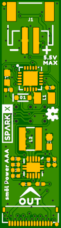
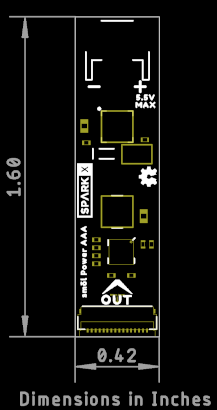

# SparkX smôl Power Board : AAA

[*SparkX smôl Power Board : AAA (SPX-18360)*](https://www.sparkfun.com/products/18360)

A power board for smôl:
- JST battery connector
- Boost converter
- Power can be provided by one or two AAA or AA batteries
- ATtiny43 for intelligent power management

## Repository Contents

- **/Documentation** - Datasheets etc.
- **/Hardware** - Eagle design files
- **LICENSE.md** contains the licence information

## Product Versions

- [SPX-18360](https://www.sparkfun.com/products/18360) - Original SparkX Release.

## License Information

This product is _**open source**_!

Please review the LICENSE.md file for license information.

If you have any questions or concerns on licensing, please contact technical support on our [SparkFun forums](https://forum.sparkfun.com/viewforum.php?f=123).

Distributed as-is; no warranty is given.

- Your friends at SparkFun.
